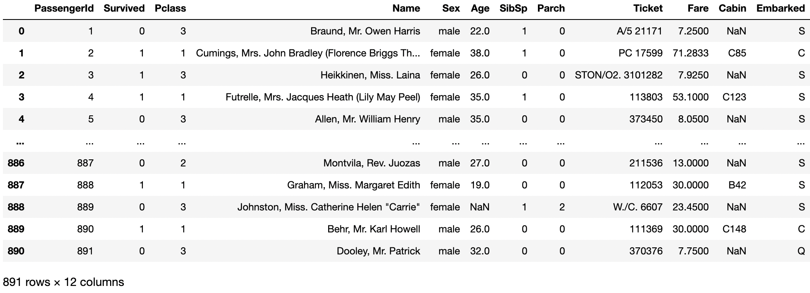
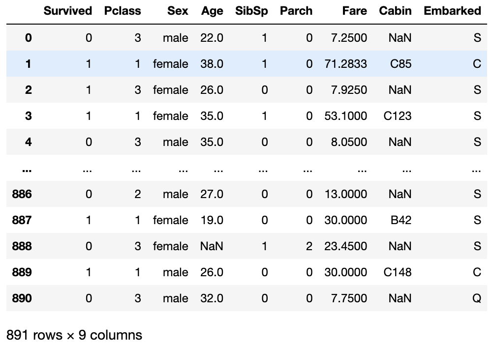
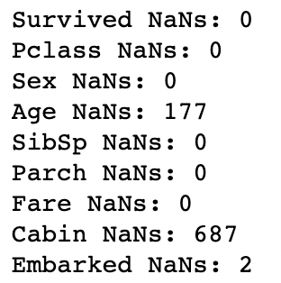

# Kaggle Titanic Survival Prediction
## End Accuracy `83.33%`
Predicting passenger survival aboard the titanic in Kaggle's Titanic Dataset Competition. Below, I detail an executive summary of my process, including cleaning, encoding, normalization, model selection, training and inference.

## The Raw Data
  

## Data Cleaning
Drop irrelevant columns: `raw_df.drop(columns=['PassengerId', 'Ticket', 'Name'])`.  
  
You've noticed a few imperfections, such as `NaN`s. Let's see the extent of the problem.  
. 

## Technology Stack