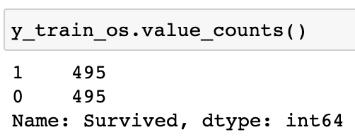
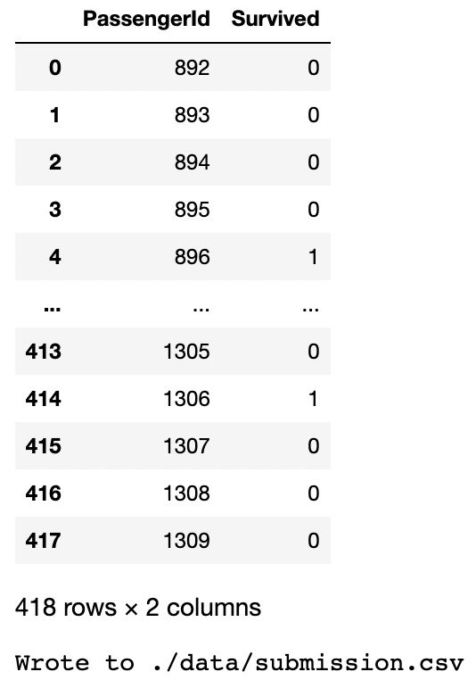

# Kaggle Titanic Survival Prediction
## End Accuracy `83.33%`
Predicting passenger survival aboard the titanic in Kaggle's Titanic Dataset Competition. Below, I detail an executive summary of my process, including cleaning, encoding, splitting, normalizing, oversampling, model selection, training inference and the technology stack to reproduce my results.  

## The Raw Data
  
Our prediction target is `Survived`.  

## Data Cleaning
Drop irrelevant columns: `cleaned_df = raw_df.drop(columns=['PassengerId', 'Ticket', 'Name'])`.  
  
You've noticed a few imperfections, such as `NaN`s. Let's see the extent of the problem.  
  
*NOTE*: The `Cabin` variable would be very helpful to include. Undoubtedly, a passenger's position in the ship affects their mortality in the event of a disaster. However, 687 entries out of 891 are `NaN`, far too many blanks for this variable to be useful. So, we'll drop it aswell.  
`cleaned_df.drop(columns=['Cabin'], inplace=True)`  

## Completing
The `Age` variable contains 177 `NaN`s, a small enough number to simply fill the empty with the average age. Alternatively, one could compute the distribution of the `Age` variable and fill the empty cells with numbers randomly selected from described distribution.  
`cleaned_df['Age'].fillna(cleaned_df['Age'].mean(), inplace=True)`  

## Encoding
The `Sex` and `Embarked` variables need to be encoded from strings to numbers.  
```
cleaned_df['Sex'].replace({'male': 1, 'female': 0}, inplace=True)
cleaned_df['Embarked'].replace({'S': 0, 'C': 1, 'Q': 2, 'UNK': 3}, inplace=True)
```  
Our cleaned, encoded dataframe.  
  

## Splitting
```
X = cleaned_df.drop(columns=['Survived'])
y = cleaned_df['Survived']
X_train, X_test, y_train, y_test = train_test_split(X, y, test_size=0.1, random_state=42)
```  
## Normalization
After we split our data, we may scale our two continuous variables `Age` and `Fare`, fit our normalization `MinMaxScaler` to the training data.  
```
from sklearn.preprocessing import MinMaxScaler
scaler = MinMaxScaler()
scaler.fit(X_train[['Age', 'Fare']])

X_train_scaled[['Age', 'Fare']] = scaler.transform(X_train[['Age', 'Fare']])
```  
Our normalized dataframe.  
  

## Oversampling
Upon inspecting our dependant variable, `Survived`, we notice a distinct class imbalance.  
  
Let's correct that:  
```
oversampler = SMOTE()
X_train_scaled_os, y_train_os = oversampler.fit_resample(X_train_scaled, y_train)
```  
Our new, balanced class.  
  

## Tensor pre-processing
Our final pre-processing step is to load the data we have at this point into a PyTorch `DataLoader`.  
```
train_ds = [(torch.tensor(X_data, dtype=torch.float, requires_grad=True), torch.tensor(y_data, dtype=torch.float, requires_grad=True)) for X_data, y_data in zip(X_train_scaled_os.values, y_train_os)]

validation_ds = [(torch.tensor(X_data, dtype=torch.float, requires_grad=True), torch.tensor(y_data, dtype=torch.float, requires_grad=True)) for X_data, y_data in zip(X_test_scaled.values, y_test.values)]

train_dataloader = torch.utils.data.DataLoader(train_ds, batch_size=len(train_ds) // 10, shuffle=False)
val_dataloader = torch.utils.data.DataLoader(validation_ds, batch_size=len(validation_ds) // 10, shuffle=False)
```  

## Model Creation
For this competition I'm going to elect to use a neural network as it's fairly robust to hyper-parameter choice and can be very easily implemented. My alternate choice would be to use a `RandomForest` model from the `scikit-learn` library, and iteratively search for the optimal hyper-parameter combination.  
*NOTE*: An entity embedding (in the form of `nn.Embedding`) is not needed in this model as our only categorical variable `Embarked` has a cardinality of four, and the rest of the variables, like `Pclass` are either ordinal, or continuous.  
```
model = nn.Sequential(
    nn.Linear(input_neuron_count, input_neuron_count // 2),
    nn.ReLU(),
    nn.Linear(input_neuron_count // 2, 1)
)

loss_fcn = nn.BCEWithLogitsLoss()
adam_optim = optim.Adam(model.parameters(), lr=1e-1)
```  

## Training and Inference
My custom functoins for training `training_loop()`, preprocessing `preprocessing()` and DataLoader creation `create_dl()` are verbose, so I won't include them here. They're availble inside my notebook, you should check them out! I'll give you a double stuff mint oreo cookie :O  
The output of my custom `inference()`:  
  

## Technology Stack
To replicate my environment, simply run `conda env create -f environment.yml` from this repositories root directory.